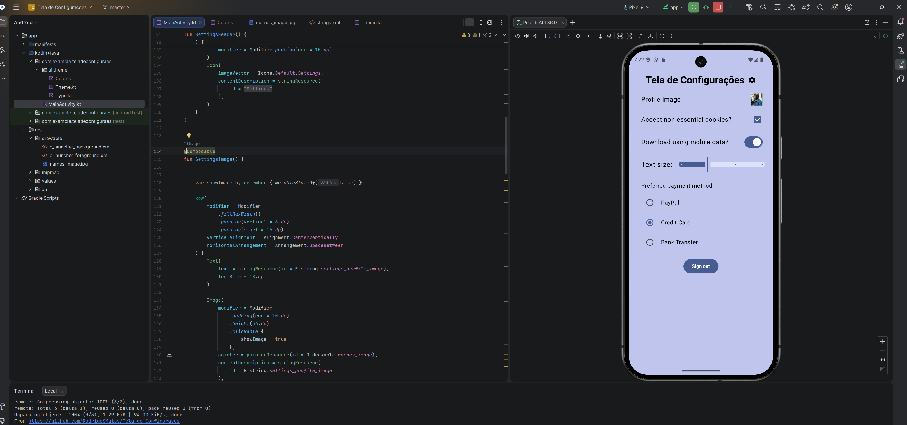

Atividade Android Kotlin

📄 Sobre
Essa foi uma atividade bem fácil de se fazer, já que você já deixou todo o código pronto no PDF, não houve nenhuma dificuldade em fazer, exceto pela virtualização que estava desativada na BIOS (levei 1 hora para descobrir o que era o erro e como arrumar).

DESAFIOS EXTRA

Troquei a imagem para a do grandissíssimo Marnes
Adicionei funcionalidade ao clickable da imagem de perfil para abrir a imagem em tamanho maior
Troquei a cor de fundo para azulCavalo que adicionei no Color.kt
Coloquei para exibir dinamicamente o valor selecionado no Slider

